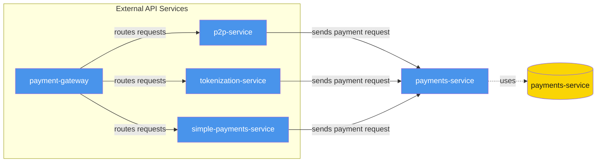

## Service in general architecture

### Stage 1 (keep external API services external)

```mermaid
flowchart LR
    subgraph External API Services
    direction LR
        payment-gateway:::is -- routes requests --> p2p-service:::is
        payment-gateway:::is -- routes requests --> tokenization-service:::is
        payment-gateway:::is -- routes requests --> simple-payments-service:::is
    end
    
    
    p2p-service:::is -- sends payment request --> payments-service:::is
    tokenization-service:::is -- sends payment request --> payments-service:::is
    simple-payments-service:::is -- sends payment request --> payments-service:::is
    
    payments-service:::is -. uses .-> database[(payments-service)]:::db
    
    classDef is fill:#4994eb, color:#ffffff;
    classDef lib fill:#f09d0e, color:#191919;
    classDef db fill:#fad505, color:#191919;
```
```