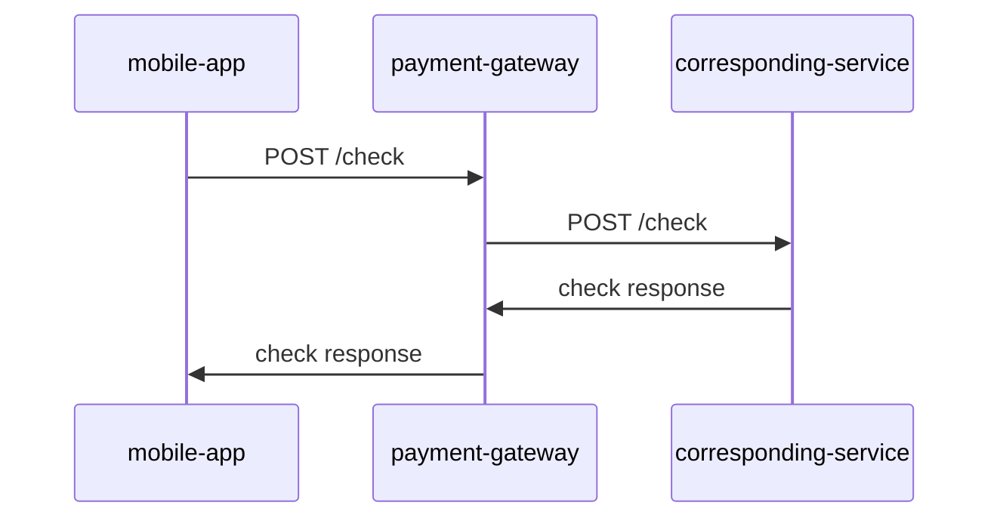
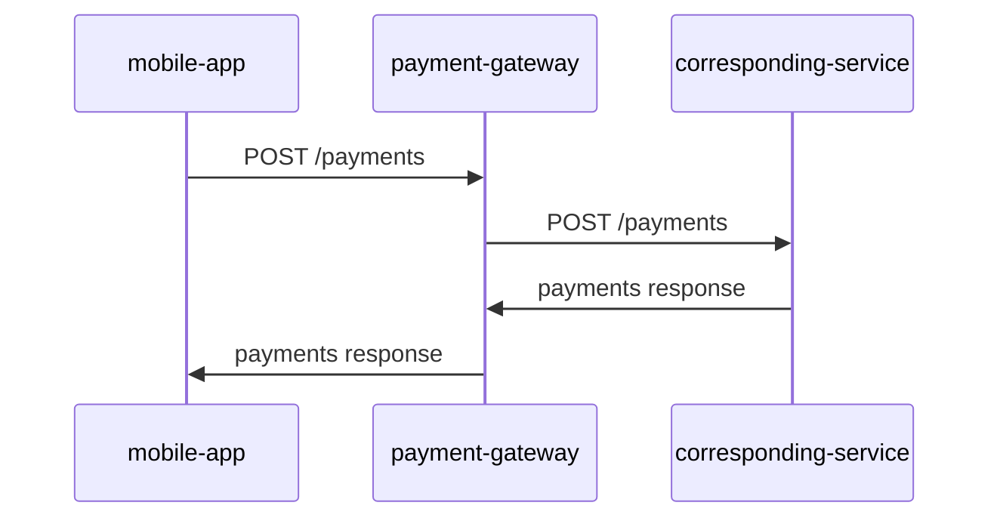
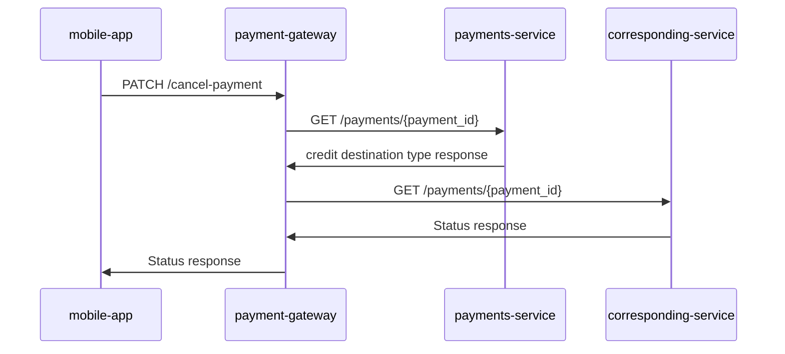
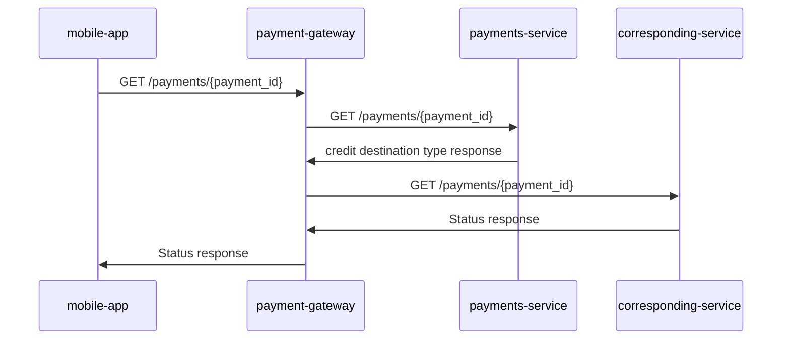
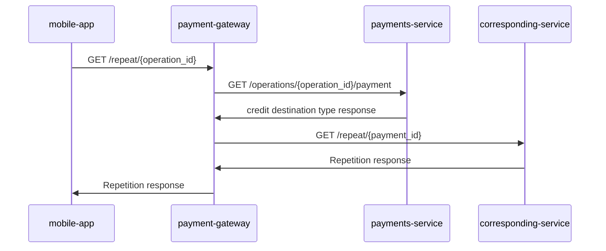

## Scenarios 

###  General info:
We have multiple possible values for credit_dst_type = `[pan, panId, external_card_id, card_token, mobile, iban]`.

According to this field we can implement routing logic (use this logic to find actual corresponding service):

- pan, panId, external_card_id, card_token -> `p2p-service`
- mobile -> `simple-payments-service` (p2m)
- iban -> `simple-payments-service` (c2a)
- else -> `simple-payments-service` (tokenization)

### 1. POST /check (generic check endpoint)

### 2. POST /payments (generic payment endpoint)

### 3. PATCH /cancel-payment (generic cancel payment endpoint)

### 4. GET /payments/{payment_id} (generic get payment status endpoint) 

Stage 1

Stage 2 - Avoid extra request using redis

### 5. GET /repeat/{operationId} (generic repeat payment endpoint)

Stage 1

Stage 2 - Avoid extra request using redis